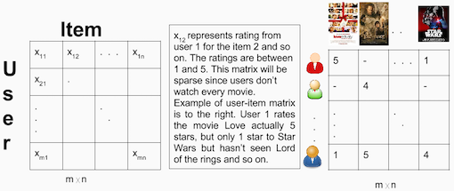
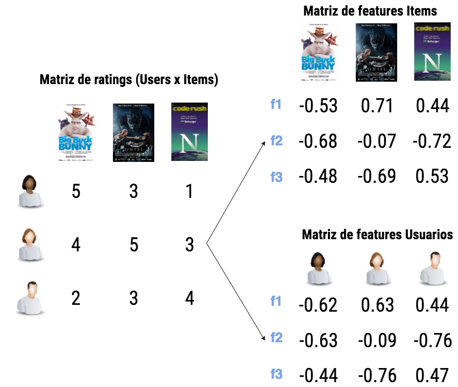
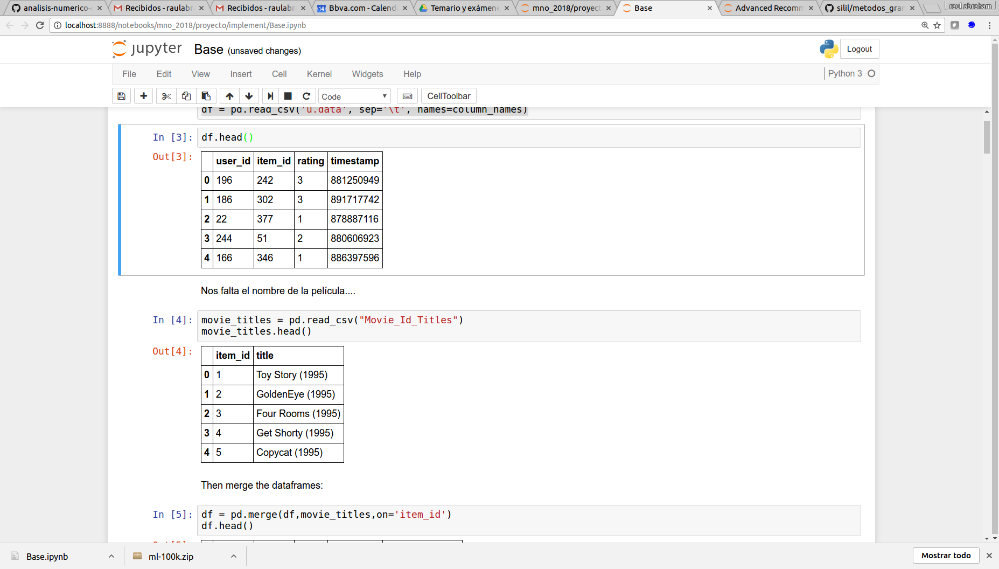
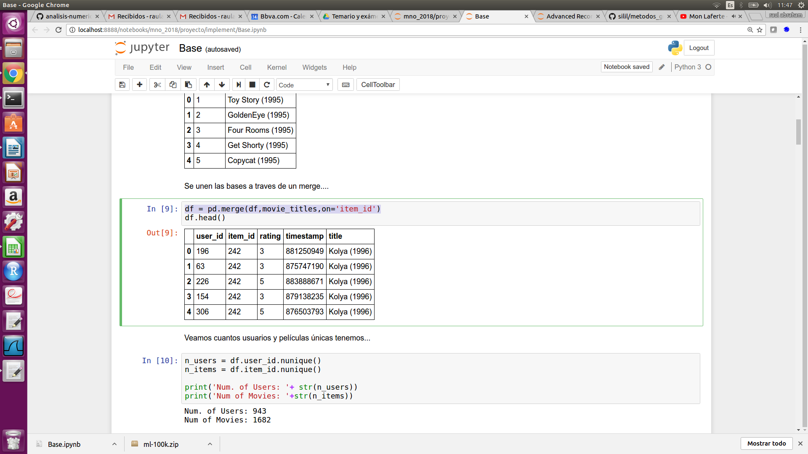
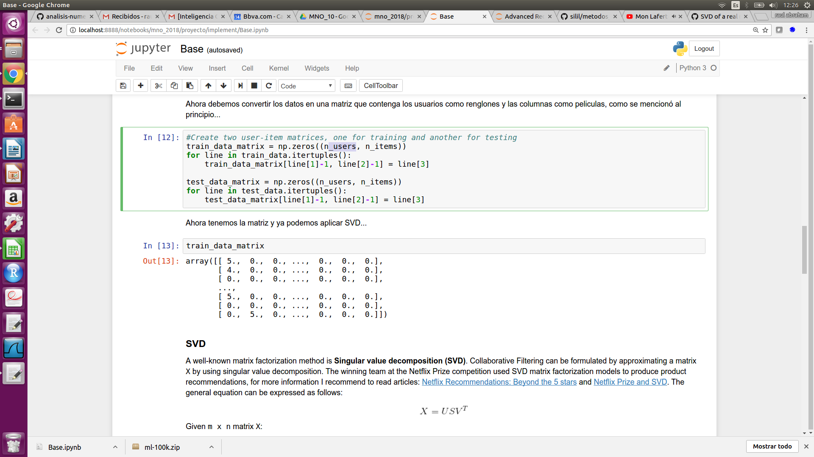
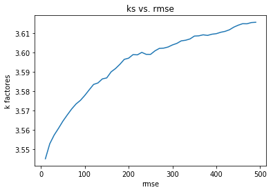

---
output:
  pdf_document: default
  author: "Abraham Nieto (51556), Roberto Acevedo (89750), Rodrigo Cedeño (176576)"
  title: ' SVD para sistemas de recomendación'
  html_document: default
---
#Equipo 10
#SVD para sistemas de recomendación

### Introducción y Objetivo del Proyecto

En este proyecto se desarrollará un algoritmo de sistemas de recomendación basado en filtrado colaborativo que sea capaz de dar una acertada sugerencia dependiendo el sistema al que se aplique. Para poder generar este sistema de recomendación se utilizará el método de descomposición SVD (Singular Value Descomposition), debido a que es uno de los que tienen mejor respuesta y resultados tienen. Debido a que uno de los objetivos del proyecto es desarrollar este sistema de recomendación en una plataforma en paralelo, se utilizará CUDA, por lo que se desarrollará el algoritmo utilizando CuSolver que ayuda a encontrar la descomposición SVD con vectores singulares.

La razón principal por la que se seleccionó este proyecto es debido a que en la actualidad los sistemas de recomendación forman parte fundamental de muchas de las aplicaciones y herramientas que son parte de nuestra vida diaria, estas ayudan a que nuestra experiencia de navegación y utilización sea de mayor calidad y más personalizada. Durante los últimos años se ha invertido mucho dinero y tiempo en investigación para mejorar estos sistemas de recomendación y que sean lo más precisos posibles. Es por esto que durante la investigación que realizamos, seleccionamos la descomposición SVD, la cual por ejemplo fue utilizada en el famoso concurso de Netflix, donde en conjunto con algunos otros algoritmos, formó parte de la solución ganadora. Una desventaja de este sistema es que puede llegar a ser un tanto lento para cantidades de información muy grandes, pero sus resultados son altamente confiables.


### Introducción al Filtrado Colaborativo

Comenzaremos explicando a detalle en qué consiste el filtrado colaborativo, ya que forma parte de las bases de nuestro algoritmo y de los sistemas de recomendación. Los sistemas de recomendación y que específicamente utilizan filtrado colaborativo como su nombre lo sugiere, utilizan los datos o valoraciones (ya existentes) de cierto usuarios para predecir las valoraciones del resto del conjunto. Este concepto es sumamente importante debido a que en conjunto con la descomposición SVD funciona de manera muy eficiente.

Para poder realizar la clasificación de usuarios y poder adaptar el algoritmo al filtrado colaborativo, se debe seleccionar el sistema de clasificación para poder seleccionar los elementos que serán más parecidos a nuestro usuario y así poder realizar una clasificación clara. De los tres tipos de clasificación se encuentra el método basado en memoria, metodo basado en modelos y el método híbrido. De los anteriores se utilizará el método basado en modelos, ya que una vez que se construyan los vectores a partir de la descomposición, se podrá utilizar una matriz de votaciones para así poder seleccionar el conjunto de usuarios más similiar al que utilice nuestro sistema, y generar un modelo que nos proporcione la mayor similitud.




### Introducción a SVD

SVD (Singular Value Descomposition), es un método utilizado frecuenemente en diversas aplicaciones de Ciencia de Datos. Ésta es una técnica en la que se descompone una matriz en tres distintas matrices que nos ayudará posteriormente a utilizar cada una de ellas en nuestro sistema de recomendación. Como se menciona en el paper de Ricardo Moya["SVD APLICADO A SISTEMAS DE RECOMENDACIÓN BASADOS EN FILTRADO COLABORATIVO"](http://informatico.ricardomoya.es/docs/ProyectoFinDeMaster_V1.pdf) Respecto a las dimensiones de las matrices tenemos que la matriz A va a tener unas dimensiones de (n × m) es decir n filas y m columnas. La matriz U va a tener dimensión (n×n), la matriz S tendrá dimensión (n×m) y por último la matriz V tendrá dimensión (m × m). Al ser V una matriz cuadrada las dimensiones de la matriz traspuesta serán las mismas que la matriz original. Es importante notar que las matrices tienen que cumplir con ciertas propiedades para poder ser utilizadas en estos cálculos. Si se desea revisar a profundidad este tema, se pueden consultar las referencias anexas a este documento, donde se explica a detalle este procedimiento.


### SVD y el Filtrado Colaborativo

Como es de esperarse, el método de SVD juega un papel súmamente importante en el filtrado colaborativo, y tanto en la selección de vectores para los usuarios globales como en la selección de vectores para nuestro usuario y sus preferencias a predecir. El poder de este algoritmo es importante ya que nos ayuda a  encontrar una relación entre item y usuario y así calcular las distancias que existe entre cada uno para así aplicar alguna métrica de similutd para el filtrado colaborativo. Esto nos ayudará en gran medida a entender correctamente el proceso que se debe realizar para poder aplicar la descomposición SVD a sistemas de recomendación y con esto construir el algoritmo necesario para la paralelización del proceso. 



De manera breve explicaremos el papel que juega cada una de las matrices obtenidas de la descomposición SVD. Específicamente la matriz U contendrá a los usuarios en una dimensión de: usuarios x K). La matriz V contendrá a los items a recomendar en una dimensión de: items x K. La matriz S puede ser dividida en dos matrices y la mutliplicamos por cada una de las U y V, podremos obtener una matriz U y V con los factores caracterísiticos de cada usuario y item y así poder predecir los items faltantes para cada usuario.

### Cálculo de las matrices U, S y V

#### Cálculo de la matriz U

1. Para poder obtener la matriz U debemos multiplicar la matriz A por su transpuesta para de esta maner obtener una matriz cuadrada como especificamos con anterioridad.

$$ A_{n \times m} \times A_{m \times n}^{t} = C_{n \times n}$$

2. Como segundo paso se obtienen los autovalores 
3. Se obtienen los autovectores una vez que tenemos los autovalores
4. Con los autovalores y autovectores obtenemos la matriz U

#### Cálculo de la matriz V

Mismos pasos que para obtener matriz U pero la primera multiplicación es al revés

$$ A_{m \times n}^{t} \times A_{n \times m} = C_{m \times m}$$

1. Para poder obtener la matriz U debemos multiplicar la matriz A por su transpuesta para de esta maner obtener una matriz cuadrada como especificamos con anterioridad.
2. Como segundo paso se obtienen los autovalores 
3. Se obtienen los autovectores una vez que tenemos los autovalores
4. Con los autovalores y autovectores obtenemos la matriz U


#### Cálculo de matriz S

1. Utilizar los autovalores y obtener la raiz cuadrada de estos.
2. Los autolvalores formarán la diagonal de la matriz S
3. El resto de los valores que no sean los ubicados en la diagonal serán ceros

A continuación podremos encontrar un ejemplo de la descomposición SVD con una matriz pequeña:


### Ejemplo de SVD

Para el presente ejemplo de descomposición en valores singulares se utilizará la siguiente matriz $A$:

$$A = \begin{bmatrix} 1 & 1 \\ 0 & 0 \end{bmatrix}$$

#### 1. Cálculo de Valores y Vectores Propios

Para obtener los valores singulares de una matriz $A$, se debe de encontrar el determinante de la matriz $A^{T}A-\lambda I$. Con la matriz ejemplo tenemos:

$$A^{T}A = \begin{bmatrix} 1 & 0 \\ 1 & 0 \end{bmatrix}\begin{bmatrix} 1 & 1 \\ 0 & 0 \end{bmatrix} = \begin{bmatrix} 1 & 1 \\ 1 & 1 \end{bmatrix}$$

Luego restamos $\lambda I$:

$$A^{T}A - \lambda I = \begin{bmatrix} 1 & 1 \\ 1 & 1 \end{bmatrix} - \begin{bmatrix} \lambda & 0 \\ 0 & \lambda \end{bmatrix} = \begin{bmatrix} 1-\lambda & 1 \\ 1 & 1-\lambda \end{bmatrix}$$

Y obteniendo el determinante tenemos que:

$$det(A^{T}A-\lambda I) = (1-\lambda)^{2}-1 =\lambda(\lambda-2)$$
Y por lo tanto los valores propios son: $\lambda_{1}=0$ y $\lambda_{2}=2$

Por lo que los valores singulares son las correspondientes raices cuadradas de los valores propios: $\sigma_{1}=0$ y $\sigma_{2}=\sqrt{2}$

Por otra parte, para obtener los vectores propios se sustituyen los valores propios en la matriz $A^{T}A - \lambda I$ y se multiplica por el vector que se desea obtener de tal manera que el resultado se un vector nulo. Por lo tanto:

$$(A^{T}A - \lambda_{1} I)V_{1} = \begin{bmatrix} 1 & 1 \\ 1 & 1 \end{bmatrix}V_{1}$$
$$(A^{T}A - \lambda_{2} I)V_{2} = \begin{bmatrix} -1 & 1 \\ 1 & -1 \end{bmatrix}V_{2}$$

E igualando a cero cada ecuacion obtenemos que:

$$V_{1} = \begin{bmatrix} -1 \\ 1 \end{bmatrix} ,  V_{2} = \begin{bmatrix} 1 \\ 1 \end{bmatrix}$$

#### 2. Descomposición SVD

Un primer paso para obtener la descomposición de $A = U\Sigma V^{T}$ es normalizar los vectores propios. Por lo tanto:

$$V^{*}_{1} = \begin{bmatrix} -1/\sqrt{2} \\ 1/\sqrt{2} \end{bmatrix} ,  V^{*}_{2} = \begin{bmatrix} 1/\sqrt{2} \\ 1/\sqrt{2} \end{bmatrix}$$

Por lo que $V$ y $V^{T}$ serían:

$$V = V^{T} =\begin{bmatrix} -1/\sqrt{2} & 1/\sqrt{2}\\ 1/\sqrt{2} & 1/\sqrt{2}\end{bmatrix} $$

Por otra parte, $\Sigma$ corresponde a la matriz diagonal con los valores singulares de $A$:

$$\Sigma =\begin{bmatrix} 0 & 0\\ 0 & \sqrt{2}\end{bmatrix} $$

Y para $U$, se debe de sustituir los valores singulares y los vectores propios normalizados en la siguiente ecuación:

$$ U_{i} = \frac{1}{\sigma_{i}}AV^{*}_{i}$$

Esto solamente para valores singulares no nulos, por lo que:

$$U_{1}  = \begin{bmatrix} 0 \\ 0 \end{bmatrix}$$

$$U_{2} = \frac{1}{\sqrt{2}}\begin{bmatrix} 1 & 1 \\ 0 & 0 \end{bmatrix}\begin{bmatrix} 1/\sqrt{2} \\ 1/\sqrt{2} \end{bmatrix} = \begin{bmatrix} 1 \\ 0 \end{bmatrix}$$

Y finalmente sustituyendo tenemos que:

$$A = \begin{bmatrix} 0 & 1 \\ 0 &0 \end{bmatrix}\begin{bmatrix} 0 & 0\\ 0 & \sqrt{2}\end{bmatrix}\begin{bmatrix} -1/\sqrt{2} & 1/\sqrt{2}\\ 1/\sqrt{2} & 1/\sqrt{2}\end{bmatrix}$$


### Función cuSolver

En el siguiente documento se pueden visualizar funciones de CUDA BLAS (CUBLAS) en la codificación del algoritmo, por lo que se profundizó en la búsqueda de las funciones y se encontró la librería cuSOLVER en la siguiente [referencia](https://docs.nvidia.com/cuda/cusolver/index.html) A grandes rasgos la librería cuSOLVER es un paquete de tres librerías que realizan operaciones complejas de algebra lineal. Las librerias son las siguientes: A. cuSolverDN: Dense LAPACK. Entre algunas de sus funciones provee rutinas para bidiagonalización de matrices y para SVD.

#Explicación de la Bidiagonalización

Sea la matriz:

$$
A = \left[\begin{array}
{rrr}
5 & 1 & 10 \\
3 & 6 & 0 \\
8 & 9 & 4 \\
\end{array}\right]
$$
```{r}
A <- matrix(c(5,1,10,
              3,6,0,
              8,9,4), byrow = T, ncol = 3, nrow = 3)
```
Le aplicamos la función de SVD: 

```{r}
s <- svd(A)
s
D <- diag(s$d) 
D
s$u %*% D %*% t(s$v)
```

De acuerdo con el método de Golub  tenemos lo siguiente:

Bucamos una matriz $V_{k}$ ortogonal de $nxn$ y una matriz $U_{k}$ con columnas ortonormales de $mxn$ tales que $U_{k}^T A-V_{k}=B$ sea Bidiagonal

Usamos la matriz $A$ y calculamos $B$ Donde podemos hacer matrices Bidiagonales por una función...

```{r}
bidiag <- function(upper, lower, main){
    out <- matrix(0,length(main),length(main))
    diag(out) <- main
    indx <- seq.int(length(upper))
    out[cbind(indx+1,indx)] <- lower
    out[cbind(indx,indx+1)] <- upper
    return(out)
}
bidiag(1:2, 0:0, 3:5)
```

o las podemos calcular  $U_{k}^T A-V_{k}=B$
```{r}
B <- t(s$u) %*% A - s$v
B
```

y Aplicamos SVD a $B$.

```{r}
sB<- svd(B)
sB
```
La explicación generalizada del algoritmo se puede ver [aqui](http://www3.math.tu-berlin.de/Vorlesungen/SS14/MatricesGraphsPDEs/paper_for_students/0711019.pdf)

Por otro lado, también se consultó la siguiente [referencia](https://developer.nvidia.com/sites/default/files/akamai/cuda/files/Misc/mygpu.pdf) donde se encuentran algoritmos para la descomposición SVD utilizando las librerías de cuSolver.

### Implementación

A continuación se realizará una descripción de los datos que se utilizarán en el proyecto:

Los datos fueron recolectados por "GroupLens Resarch Project" en la Universidad de Minnesota y consisten de lo siguiente:

* 100,000 ratings con calificaciones del 1 al 5
* Calificaciones de 943 usuarios
* Calificaciones de 1682 películas
* Cada usuario calificó por lo menos 20 películas
* Información demográfica de cada usuario (edad, género, ocupación y código postal)

#### ¿Cómo fue recolectada la información?

La información fue recolectada a través del sitio de intenrnet de la compañía MovieLens (movielens.umn.edu) en un periodo de 7 meses de septiembre 19 a abril 22 de 1988. 

Los datos fueron limpiados de la siguiente manera:

* Usuarios con menos calificaciones de menos de 20 películas fueron removidos
* Usuarios sin información demográfica completa fueron removidos

#### Descripción de archivos

1. ml-data.tar.gz -> carpeta comprimida con todos los archivos

2. u.data -> dataset completo numerado del 1 al 100,000. Los datos están ordenados de manera aleatoria separado de la siguiente manera:
user id | item id | rating | timestamp

3. u.info -> números de usuarios, items y ratings

4. u.item -> información sobre las películas con las siguientes columnas:
movie id | movie title | release date | video release date |
IMDb URL | unknown | Action | Adventure | Animation |
Children's | Comedy | Crime | Documentary | Drama | Fantasy |
Film-Noir | Horror | Musical | Mystery | Romance | Sci-Fi |
Thriller | War | Western |

5. u.genere -> lista de géneros de películas

6. u.user -> información demográfica de los usuarios con las siguientes columnas:
user id | age | gender | occupation | zip code

7. u.occupation -> lista de ocupaciones

8. u1.base - u5.base y u1.test - u5.test -> esta es una división de 80%/20% donde se divide un set de entrenamiento y un set de prueba de todos los datos

9. ua.base, ua.test, ub.base, ub.test -> esta es una división de prueba y entrenamiento con exactamente 10 ratings por usuario

10. allbut.pl -> es un script que genera los sets de prueba y entrenamiento en porcentajes deseados

11. mku.sh -> un shell script para generar todos los datasets u de u.data

Para la implementación se creó un pipeline combinando python 3.6 con CUDA de forma que el proceso trabaja en 3 pasos generales: python: tratamiento de datos->CUDA: descomposición SVD->python evaluación de predicciones y selección de factores. 

#### Base para Pruebas 

De acuerdo con lo que hemos comentado en los avances vamos a utilizar la base MovieLens que contiene 100mil clificaciones de 943 usuarios y 1682 peliculas la base la podemos obtener de esta[ubicacion](http://files.grouplens.org/datasets/movielens/ml-100k.zip).


#### 1.Armado de la base 

Toda esta primera fase se puede ver en el notebook [Base.ipynb](Base.ipynb) hecho en python.

El objetivo es transformar la información de MovieLens en una matriz donde los renglones sean los usuarios y las columnas las películas, encada celda tendremos la calificación de ese usuario i a la película j si es que existiera. Esta primera parte se procesará en python.

Primero vamos  a leer la información:
La base u.data contiene los ids de usuarios y la calificación que le da a cada película, la base Movie_Id_Titles tiene los nombres e ids de las películas:
`column_names = ['user_id', 'item_id', 'rating', 'timestamp']` 
`df = pd.read_csv('u.data', sep='\t', names=column_names).`
`df.head()`
`movie_titles = pd.read_csv("Movie_Id_Titles")`
`movie_titles.head()`



Después se unen ambas bases  a través de un merge...
`df = pd.merge(df,movie_titles,on='item_id')`



Una vez teniendo la base de acuerdo como se muestra en la figura anterior, entonces haremos una partición de datos,80% entrenamiento, con la finalidad de tener datos de prueba para medir las predicciones que se darán, esto como cualquier método de machine learning.

`train_data, test_data = train_test_split(df, test_size=0.2)`

Ahora debemos convertir los datos en una matriz que contenga los usuarios como renglones y las columnas como películas, como se mencionó al principio...


Para convertir el dataset en matriz hacemos lo siguiente:

`train_data_matrix = np.zeros((n_users, n_items))`
`for line in train_data.itertuples():`
    `train_data_matrix[line[1]-1, line[2]-1] = line[3]`  

`test_data_matrix = np.zeros((n_users, n_items))`
`for line in test_data.itertuples():`
    `test_data_matrix[line[1]-1, line[2]-1] = line[3]`



Con la matriz User-Items ya lista el filtrado colaborativo se puede formular aproximando una matriz X mediante el uso de la descomposición de valores singulares. 

 

Después podemos aplicar SVD con librería scipy de python  a la matriz de entrenamiento, probando con 10 factores y medir el rmse (raíz del error cuadrático medio) de las prediccicones vs. los ratings de los datos de test.

`u, s, vt = svds(train_data_matrix, k =10)` 


Dado lo mostrado en esta parte 1 lo siguiente es obtener la matriz de entrenamiento como input del programa svd.cu y de esta forma hacer el SVD en cuda para optimizar tiempo...

Revisamos la dimensión de la matriz train_data_matrix:

`np.shape(train_data_matrix)`

y vemos que tenemos una matriz de dimensión 943 X 1682, en este caso m menor que n y de acuerdo al programa [svd.cu](svd.cu) se debe cumplir que m>=n por tanto vamos a guardar la matriz transpuesta.

Guardamos la matriz de entrenamiento en un archivo txt:

`np.savetxt('train_data_matrix_T.txt', train_data_matrix.transpose())` 


#### 2.Descomposición SVD

Para Hacer la descomposición de la matriz train_data_matrix_T.txt usamos el siguiente programa de Cuda 
[svd_f.cu](svd_f.cu) el cual está basado en el programa [svd.cu](svd.cu)

1-Ponemos la Lectura de archivo para la matriz [train_data_matrix_T.txt](train_data_matrix_T.txt):

```

        if (argc<2) {
                cout << "Input file not specified. Please, specify it as a first argument." << endl;
                cout << "example: " << argv[0] << " train_data_matrix_T.txt" << endl;
                return -1;
        }
        ifstream file(argv[1]);
        ofstream S_diag("S_diag.txt");
        ofstream U_rows("U_rows.txt");
	ofstream VT_cols("VT_cols.txt");


```

2-se hace la descomposición SVD usando cusolverDnDgesvd:

``` 

 // --- CUDA SVD execution

    assert(cusolverDnDgesvd (solver_handle,'A','A',m,n,d_A,lda,d_S,d_U,lda,d_VT,lda,d_work,work_size,d_rwork,devInfo));
    assert(cudaDeviceSynchronize());


    // --- Moving the results from device to host

    assert(cudaMemcpy(U.el , d_U , sizeof(double)*lda*m, cudaMemcpyDeviceToHost));
    assert(cudaMemcpy(VT.el, d_VT, sizeof(double)*lda*n, cudaMemcpyDeviceToHost));
    assert(cudaMemcpy(S , d_S , sizeof(double)*n, cudaMemcpyDeviceToHost));
    assert(cudaMemcpy(&info_gpu, devInfo, sizeof(int), cudaMemcpyDeviceToHost)); 

```

3-Obtenemos las matrices  [S](S_diag.txt), [U](U_rows.txt), [VT](VT_cols.txt) 


```
    assert(0 == info_gpu);
    printf("Singular values\n");
    for (int k=0; k<n; k++){
                        S_diag << S[k] << " ";
    }
    
    printf("=====\n");
    printf("\nLeft singular vectors - For y = A * x, the columns of U span the space of y\n");
    for (int k=0; k<m; k++){
                for (int j=0; j<m; j++)
                        U_rows << U.el[k+j*lda] << " ";
                U_rows << endl;
    }
    
    printf("=====\n");
    printf("\nRight singular vectors - For y = A * x, the columns of V span the space of x\n");
    for (int k=0; k<n; k++){
                for (int j=0; j<n; j++)
                        VT_cols << VT.el[k+j*lda] << " ";
                VT_cols << endl;
    }

```

#### compilamos

Con esta linea compilamos: 

`nvcc svd_f.cu -o svd_f.out -lcublas -lcusolver`

Ejecutamos: 

`./svd_f.out train_data_matrix_T.txt`


#### 3.Uso de la matrices

Esta última fase se puede ver en el notebook [3ra fase.ipynb](3ra fase.ipynb) hecho en python.

Cargamos las matrices U,S,VT resultantes de Cuda en python usando la librería numpy:

```
sigma = np.loadtxt('S_diag.txt')
U = np.loadtxt('U_rows.txt')
V = np.loadtxt('VT_cols.txt')

```

y ahora vemos cual es la mejor k para las predicciones haciendo el producto U*sigma*V con distintas k's:

```
k=[] 
rms=[]
for i in range(10,500, 10):
    pred = np.matrix(U[:, :i]) * np.diag(sigma[:i]) * np.matrix(V[:i, :])
    pred=pred.transpose()
    a=rmse(np.array(pred), test_data_matrix)
    k=np.append(i,k)
    rms=np.append(a,rms)
print(k,rms)


```

Recordar que corrimos con la matriz transpuesta por tanto hay que volverla transponer para obtener los resultados:

```
pred=pred.transpose()

```

y finalmente si graficamos el número de factores vs. el rmse vemos que a mayor número de factores el error se incrementa, el mejor k es 10.



##Conclusiones.

Dado que el tiempo de ejecución fue mejor usando CUDA (5 seg vs. 7seg) que lo que tarda python, lo cual era esperado dado lo que se vio en el artículo “Singular Value Decomposition on GPU using CUDA” de S. Lahabar y P. J. Narayanan, se valida que el tiempo requerido para el cómputo es mucho menor en GPU cuando se cuenta con matrices de dimensiones muy grandes.

La descomposición en valores singulares representa una buena opción como solución a sistemas de recomendación.

El presente trabajo mostró la utilidad del cómputo en paralelo en implementaciones utilizando otras herramientas de análisis en ciencia de datos (Python)

##Trabajo Futuro:

Implementar esta solución en un problema de mayor volumen y mayor complejidad por ejemplo recomendar productos bancarios.

Una oportunidad de desarrollo es justamente utilizar AWS por el volumen de información.

Probar otro tipo de métricas además del rmse.


### Referencias

1. [Ricardo Moya](http://informatico.ricardomoya.es/docs/ProyectoFinDeMaster_V1.pdf)

2. [J Villena](http://www.it.uc3m.es/jvillena/irc/practicas/06-07/31.pdf)

3. [B. B. Zhou](https://pdfs.semanticscholar.org/cf5e/afcd87a9fcf1c77cfb431f0b8a8518f11445.pdf)

4. [Chrzeszczyk](https://developer.nvidia.com/sites/default/files/akamai/cuda/files/Misc/mygpu.pdf)

5. [nVidia](https://docs.nvidia.com/cuda/cusolver/index.html)

6. F. Maxwell Harper and Joseph A. Konstan. 2015. The MovieLens Datasets:History and Context. ACM Transactions on Interactive Intelligent Systems (TiiS) 5, 4, Article 19 (December 2015), 19 pages. DOI=http://dx.doi.org/10.1145/2827872


